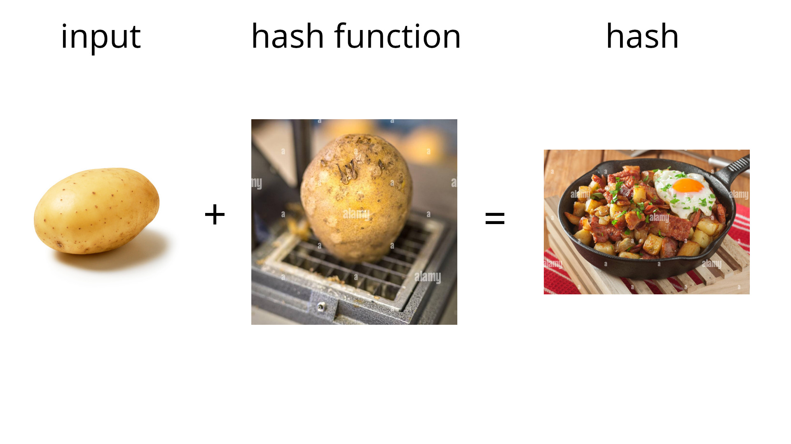
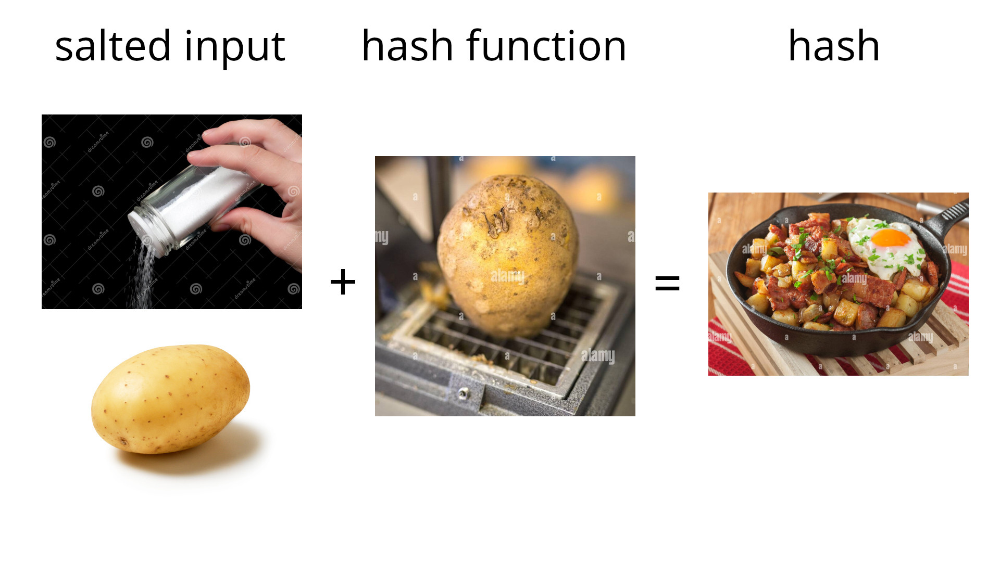
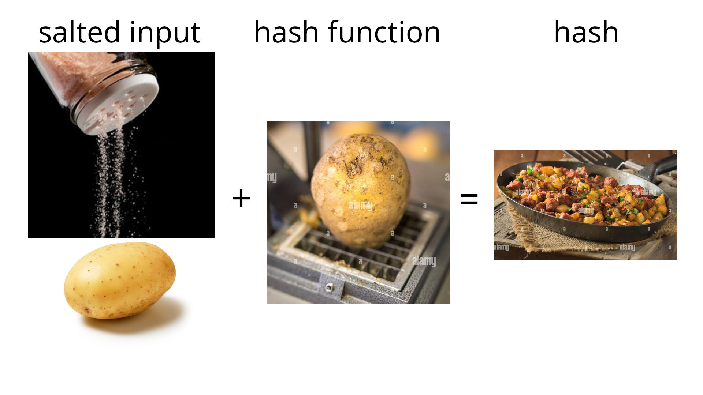
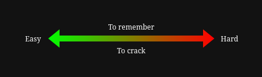
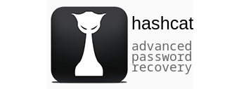
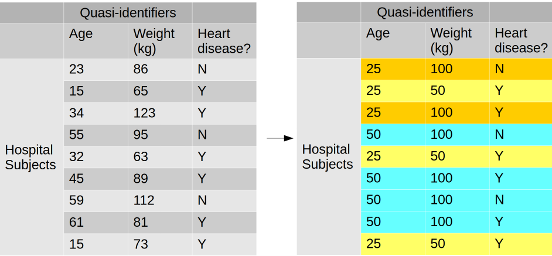
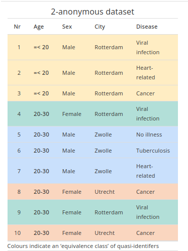
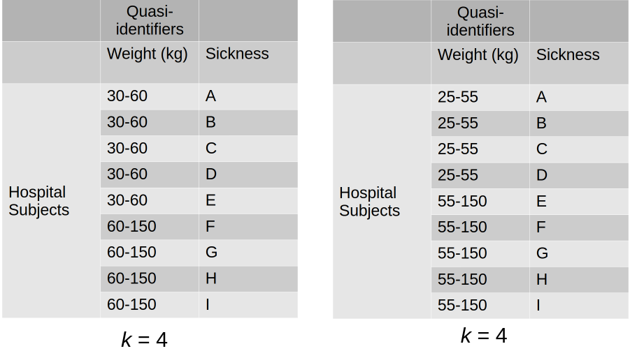
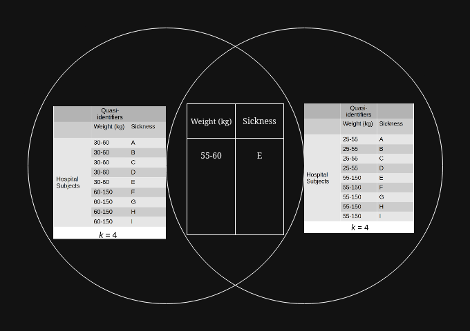
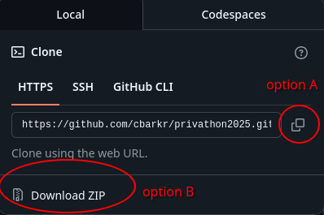

```bash[1-3|5-6|8-12]
[~] $ whatis this-workshop
this-workshop (1) - Hash cracking and de-anonymization
					for fun and profit

[~] $ whoami
Callum Barker

[~] $ cat bio.txt
Callum is a Compututing Science student @ SFU,
member of the SFU Cybersecurity Club and CTF team &&
an Information Security Engineer @ Ascinta Technologies
```

---

## Table of Contents
1. Learning Objectives
2. Background
3. Setup
4. Exercises
5. Review
6. Q&A

---

## 1. Learning Objectives
By the end of this workshop, you should (hopefully) be able to:
1. Describe (cryptographic) hashing functions and their properties
2. Apply your understanding of hashes to create secure passwords
3. Crack hashes (such as stored passwords) using Hashcat
4. Define k-anonymity and identify its strengths and weaknesses

---

## 2. Background
1. Hashing Functions
2. Passwords
3. Hashcat
4. K-Anonymity

--

### 2.1. Hashing Functions
> A function that maps data of arbitrary size to fixed-size values

--


--


--


--



--

> [!note]
> This is a terrible analogy, but I needed a way to tie it into my workshop description

notes: 
- Q: Can anybody tell me what's wrong with this analogy?
- A: In this example, the input must be at least as big as the hash output size, which is not true in practice (not to mention that there are extra steps to get to this kind of hash as output)

--

#### 2.1.1. Properties of All Hash Functions
1. Determinism (same input always produces the same output)
2. Fixed-length output
3. Sensitivity (small change in input produces large change in the output)

--

> [!error] Problems
> 1. What if, given a hash, we shouldn't be able to identify its input?
> 2. What if we want *all* of our hashes to be unique?

--

> [!success] Solution
> This is where *cryptographic* hash functions come into play

--

#### 2.1.2. Properties of Cryptographic Hash Functions
1. Pre-image Resistance
2. Second Pre-image Resistance
3. Collision Resistance

--

##### 2.1.2.1. Pre-image Resistance
> Given the output, it is hard to get the original input 

--

##### 2.1.2.2. Second Pre-image Resistance
> Given one input, it is hard to find another input that produces the same output 

--

##### 2.1.2.3. Collision Resistance
> It is hard to find two inputs that produce the same output

--

##### 2.1.2.4 Second Pre-image Resistance Vs. Collision Resistance
> [!note]
> They differ (slightly)!
> 
> - Second Pre-image Resistance: Attacker is given a particular message
> - Collision Resistance: Attacker can freely choose both messages

--

#### 2.1.3. Applications of Cryptographic Hashes
1. **Message Authentication Codes** (MACs): Verify the *integrity* and *authenticity* of a message
2. **Digital signatures**: Verify the *integrity*, *authenticity*, and *non-repudability* of a message
3. **Key Derivation Functions** (KDFs): Password-hashing

notes: You don't need to remember these, though I thought some people might be interested

--

#### 2.1.4. Cracking Hashes

| Method            | Efficiency | Description                                              |
| ----------------- | ---------- | -------------------------------------------------------- |
| Brute Force       | Terrible   | Guess and check every possible combination of characters |
| Dictionary Attack | Decent     | Guess and check candidate messages from a list           |
| Rainbow Tables    | High       | Search from pre-computed (message, hash) pairs           |

--

#### 2.1.5. Salting
> Add a random string to the message before hashing to make identical messages result in unique hashes

--



--



--

> [!important]
> Salt can be stored alongside the hash without compromising security!

--

##### 2.1.5.1. Quick Demo

--

##### 2.1.5.2. Storing Password Hashes (PHC String Format [^phc])
```
$<id>[$v=<version>][$<param>=<value>(,<param>=<value>)*][$<salt>[$<hash>]]
```

where:
- `<id>` is the symbolic name for the function
- `<version>` is the algorithm version
- `<param>` is a parameter name
- `<value>` is a parameter value
- `<salt>` is an encoding of the salt
- `<hash>` is an encoding of the hash output

[^phc]: https://github.com/P-H-C/phc-string-format/blob/master/phc-sf-spec.md

--

### 2.2. Passwords [^nist80063b]
- *Should be* stored in salted and hashed form
- *Should be* hashed using an algorithm with a **high work factor** (i.e. computational cost)

[^nist80063b]: https://pages.nist.gov/800-63-4/sp800-63b.html

notes: 
- Q: Have you guys heard of MD5? If so, can anyone tell me the main reason that it's bad for passwords? 
- A: It is *too fast*, something we typically associate with a good algorithm otherwise

--

#### 2.2.1. *Traditional* Passwords and The Human Aspect


--

#### 2.2.2. Passphrases
> A sequence of words used as a password

--


https://www.xkcd.com/936/

notes:
- Entropy: Generally denotes unpredictability and complexity in bits (based on the possible characters within and length of the password)

--

#### 2.2.3. Passwords vs Passphrases

|              | Passphrases                                           | Passwords                     |
| ------------ | ----------------------------------------------------- | ----------------------------- |
| **Storage**  | 🧠 Brain                                              | 🔐 Password manager           |
| **Use**      | Password manager unavailable                          | Password manager available    |
| **Examples** | Keys for password manager vault, full-disk encryption | Passwords for online services |

--

#### 2.2.4. In Any Case...
Enable multi-factor authentication (MFA) and your password strength doesn't really matter [^microsoft]

(but please do use strong passwords/phrases and password managers regardless)

[^microsoft]: https://techcommunity.microsoft.com/t5/Azure-Active-Directory-Identity/Your-Pa-word-doesn-t-matter/ba-p/731984

--

### 2.3. Hashcat


--

#### 2.3.1. Main Modes
| #   | Mode            | Description                               |
| --- | --------------- | ----------------------------------------- |
| 0   | Straight        | Dictionary attack                         |
| 3   | Brute-force     |                                           |
| 6   | Wordlist + Mask | Dictionary attack but brute-force postfix |
| 7   | Mask + Wordlist | Dictionary attack but brute-force prefix  |

--

#### 2.3.2. Basic Examples

```bash [1|3|4]
 Attack-Mode | Hash-Type | Example command
=============+===========+=============================================
 Wordlist    | MD5       | hashcat -a 0 -m 0 example0.hash example.dict
 Brute-Force | MD5       | hashcat -a 3 -m 0 example0.hash ?a?a?a?a?a?a
```

--

#### 2.3.3. Quick Demo!

--

### 2.4. K-anonymity
> If the information for each person contained in the dataset cannot be distinguished from at least $k − 1$ individuals whose information also appear in the dataset

--

#### 2.4.1. Data Types
1. **Identifiers** (IDs): Uniquely identifies a record (e.g. name, serial number, UUID)
2. **Quasi-identifiers** (QIDs): Can be combined with other QIDs to create a unique identifier (e.g. gender, birth date, postal code, job title)
3. **Sensitive Values**: Information that is of interest for research (e.g. disease, salary, interests, political affiliation, transactions)

--

#### 2.4.2. Example


notes: 2-anonymity since the smallest set is of size 2
- If your friend is around age 25 and weight 50kg, and you know they're in the table, what do you learn?

--

#### 2.4.3. Anonymity Set
> The subset of rows in dataset $D$ that share the same **QIDs** (but not necessarily the same sensitive attributes or identifiers)

--

##### 2.4.3.1. Property of Anonymity Sets
> $D_k$ satisfies $k$-anonymity if every anonymity set consists of at least $k$ elements.

--

#### 2.4.4. Anonymization Methods
1. **Suppression**: Remove data outright (e.g. remove column from data or replace data with NULL, etc.); applied to IDs
2. **Generalization**: Replace individual values of attributes with a broader category (e.g. round integers, broaden location to a larger region); applied to QIDs

--

#### 2.4.5. Pros/Cons of k-anonymity

| Pros                                          | Cons                         |
| --------------------------------------------- | ---------------------------- |
| Can hide QIDs without making the data useless | Introduces noise to the data |
|                                               | May still leak information!  |

--

#### 2.4.6. Attacks!
1. **Homogeneity**: Suppose all members of an anonymity set have the same sensitive value; any person in the anonymity set (i.e. possessing the relevant QIDS) is known to have a certain sensitive value
2. **Background Knowledge**: Leverages an association between one or more QIDs with the sensitive attribute to reduce the set of possible values for the sensitive attribute
3. **Complementary Release**: Releasing similar datasets multiple times may leak information

--

##### 2.4.6.1. Homogeneity and Background Knowledge Example

https://utrechtuniversity.github.io/dataprivacyhandbook/k-l-t-anonymity.html

notes: 
- Homogeneity: Any female from Rotterdam between 20 and 30 who participated had a viral infection
- Background Knowledge: If you know that your 25-year old female neighbour from Utrecht participated in this study, you learn that she suffers from cancer

--

##### 2.4.6.2. Complementary Release Example


notes: 
- Q: If your friend weights between 55 and 60 kg, what do you learn?
- A: That they 100% have sickness E

--



---

### 3. Setup
1. Workshop Files
2. Install Tools

--

#### 3.1. Workshop Files
1. Visit https://github.com/cbarkr/privathon2025
2. Either :
	1. `git clone` the repo
	2. Download it as a zip file



--

#### 3.2. Install tools
| Method      | Windows                                                                                                           | Mac                                                                                                              | Linux                                    |
| ----------- | ----------------------------------------------------------------------------------------------------------------- | ---------------------------------------------------------------------------------------------------------------- | ---------------------------------------- |
| Interactive | Install [7zip](https://www.7-zip.org/a/7z2409-x64.exe) then [Hashcat](https://hashcat.net/files/hashcat-6.2.6.7z) | Install [7zip](https://7-zip.org/a/7z2409-mac.tar.xz) then [Hashcat](https://hashcat.net/files/hashcat-6.2.6.7z) |                                          |
| CLI         |                                                                                                                   | `brew install hashcat`                                                                                           | `sudo <package-manager> install hashcat` |

---

### 4. Exercises

--

#### 4.1. Scenario
- Suppose that a small marketing firm (let's call them "Oxford Analytica") has collected data on political affiliations

--

- For each record, they store the following information:
	1. First name
	2. Last name
	3. Location
	4. Age
	5. Sex
	6. Vote

--

- In their analysis, they hope to find a correlation between age, sex, location, and vote

--

- Oxford Analytica supposedly cares about privacy, and they've heard about [k-anonymity](https://en.wikipedia.org/wiki/K-anonymity), so they try to anonymize the data like so:
	1. Suppress identifiers (first name, last name) by hashing them with SHA-256
	2. Generalize quasi-identifiers by rounding age to the nearest 5 and generalizing location to the nearest city

notes: Vote untouched since this is the sensitive data in which they're interested
 
--

#### 4.2. Tasks
1. Background Knowledge / Differencing Attack
2. Homogeneity Attack
3. Hash Cracking
4. Password Cracking
5. Anonymization

--

#### 4.2.1. Background Knowledge / Differencing Attack
- Suppose that datasets A and B differ by at most one record
- Assume, by some insider knowledge, you happen to learn the name of the last person to be added to the dataset: Joaquim Nuno Chenyi
- Who is their vote for?

--

#### 4.2.2. Homogeneity Attack
- Suppose you know a female from Burnaby who is included in the dataset
- Who is their vote for?

--

#### 4.2.3. Hash Cracking
- Suppose we want to identify the name of the youngest female in the dataset who voted "Red"
- Crack the hashes for their first and last name using Hashcat
- What is their full name?

--

#### 4.2.4. Password Cracking
- Suppose the individual from task 3 was involved in a data breach by the social media site "Fakebook", leaking names and passwords hashed with  PBKDF2-HMAC-SHA256
- We know that Fakebook's password "strength" requirements dictate that passwords must be at least 10 characters and contain at least one number and special character

--

- Also suppose that the individual, like most people, meets only the minimum password requirements in a predictable way: `<word><number(s)><special-character>`
- Using [`rockyou.txt`](wordlists/rockyou.txt) (a common password wordlist) and Hashcat, crack the password
- What is their password in plaintext?

--

> [!note]
> Hashcat's [hybrid attack](https://hashcat.net/wiki/doku.php?id=hybrid_attack) and [mask attack](https://hashcat.net/wiki/doku.php?id=mask_attack) docs may or may not be of some use to you

--

#### 4.2.5. Anonymization
- How can you correctly anonymize the dataset?

---

### 5. Review
(Nice try but I'm not including the solutions just yet)

---

### 6. Q&A
> [!question]
> Any questions? :D
